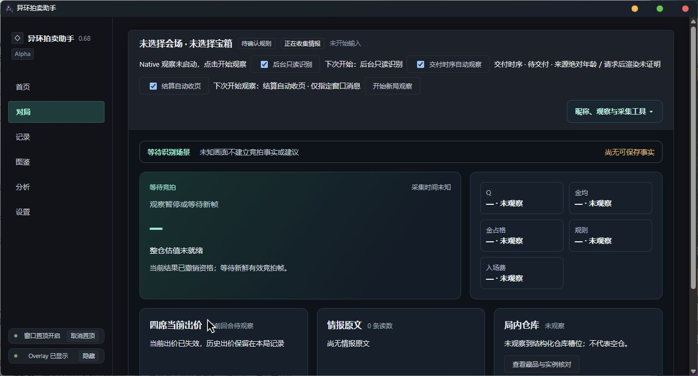

# 异环拍卖助手

为《异环》拍卖玩法提供桌面信息展示、估值计算、仓库识别和对局资料整理。产品版本为 **v0.68-alpha**，以 [core/version.py](core/version.py) 为准。

**2026-10-07：暂停开发，保留未来继续。** 当前成果保存为本地 Git 基线，不再采图、调参、开局或追加验收。真实游戏全自动流程尚未完成，不能作为已验收的无人值守助手交付。

## 界面



这是助手自身窗口的实际截图，使用空的隔离数据，禁用了视觉和总线，没有采游戏或全桌面。勾选项来自保留的本地配置，不代表模板默认值；截图不构成实机全自动通过证据。

## 目前能用什么

- 主窗口、HUD、手工字段编辑、拍卖估值计算和实验室求解器已有实现；历史资料可以查看，旧格式记录保留 LEGACY 身份。
- 仓库网格、部分格子分件、多页登记及重叠处理已有离线成果。候选框、观察组件和机器确认数都不等于准确物品总数；目录图不能单独证明身份。
- Native 指定窗口观察、后台模式、最新帧有界队列、SOURCE v2 原图保存及同图核对已有代码。慢 OCR 会跳过待处理帧，持续取帧不保证记录每条短暂情报。
- 结算自动触发和窗口滚动消息已接线，沿用本局一次及跨局换代保护。**真实稳定判定仍被未解释的物品内部像素变化阻断，真实滚动、完整覆盖和完整跨局流程未通过。**
- `offline-content/2cb94b822f75` 的离线正常收页链路通过：保存、独立支持、模拟滚动回执、滚后位移、重叠及末尾覆盖可以串起来。使用生成夹具和空身份参照，**离线 COMPLETE 不等于实机全自动通过**；共同采样模型未启用到生产。

## 怎样运行

源码入口为 `app/run.bat` 或 `app/main.py`，实验室入口为 [lab/index.html](lab/index.html)。旧日常运行包不代表本次源码。

需要 Windows x64、Python 桌面依赖、WebView2、Node 求解器以及 Native Host 的 .NET 运行环境。依赖快照为 [requirements-desktop.lock.txt](requirements-desktop.lock.txt)，环境和构建背景见 [docs/desktop-environment.md](docs/desktop-environment.md)。其中旧验收范围保留历史含义，本次不重新安装或构建。

本机保留 `build/takeover_20260905/repro-venv` 开发环境。以下方式仅打开界面、禁用视觉采集，并隔离数据；**本次没有执行这些命令**：

```powershell
# 在仓库根目录执行；已有个人配置不得覆盖。
if (!(Test-Path app/config.json)) {
    Copy-Item app/config.example.json app/config.json
}
$env:NTE_DISABLE_VISION = '1'
$env:YIHUAN_DATA_ROOT = Join-Path $PWD 'build\paused-ui-data'
& .\app\run.bat
```

个人 `app/config.json` 原地保留、不入库；Git 提供 [app/config.example.json](app/config.example.json)。模板使用 Native 档案、严格来源模式，并关闭自动收页。本地旧配置可能已开启交付模式和自动收页，不能假定它等于模板。

将来明确恢复开发后，才解除 `NTE_DISABLE_VISION` 并启动观察。保留 Host 位于 `build/native-bounded-restability-production-20261007/host/`，用 `NTE_NATIVE_HOST_EXE` 指向其中的 `WgcLiveHarness.exe`。运行需要整个 Host 目录及其依赖，不能只取 EXE。启动前核对配置、Host 身份和总线占用，不绕过占用检查或误停其他进程。

### 选项与停止

- **后台只读识别**本身不操作游戏，只观察指定窗口；最小化、窗口身份或映射失效会停止。
- **结算自动收页**是独立选项。开启后，合格结算可向指定异环窗口发送滚动消息，不激活窗口、不使用全局输入。
- **停止采集**只停止当前收页并保留部分材料，本局不重试；自动收页仍开启时，下一局仍可能触发。取消勾选**结算自动收页**同时停止当前收页并关闭后续触发。结束观察停止观察链路。
- 收页受 **16 张来源／32 次请求／70 秒**限制，截止从首次观察结算固定，不因重新判稳或探针刷新。发送成功不等于实际滚动，多页不自动代表全仓覆盖。

## 未完成与已知问题

1. WGC 来源时间未来值在游戏和自建 DXGI 窗口复现，问题未修复。严格模式保留拒绝；交付时序只证明近期交付，不能证明请求后渲染或来源绝对年龄，仍有上游迟交／重放风险。不能运行中换模式或自动降级。
2. 真实结算内容判稳尚缺能解释内部微变的证据。按钮文字、灰色外观、OCR 一致或小幅像素变化不能单独放行。原图反例保留，不再围绕同一批图调阈值。
3. 第五张后的续取修复已有实机通过结论；它不证明稳定页、真实自动滚动、完整收页、返回大厅及自然下一局已经通过。
4. 未证明跨视口对应时，不能直接累计数量或总价。裁切物件只算片段；品质、身份、数量及正式记账仍受原确认门槛约束，原图先保存不构成正式事实。
5. 项链／卡丁车拆件、57px 纵向周期、品质块未知及未见场景识别仍有边界。局部护甲或白框修复不代表所有仓库物品可用。

## 保存与恢复

源码、配置模板、测试、小型夹具及来源说明保存在 Git。个人配置、数据库、原图、录像、大型日志、编译产物、未批准候选资料和三个旧 worktree 留在本机，不强塞 Git，也不删除。

- 正式历史默认在 `%LOCALAPPDATA%\异环拍卖助手\data\history\异环拍卖数据.json`；隔离运行使用 `YIHUAN_DATA_ROOT`，不能用测试数据覆盖正式历史。
- 工作素材在 `data/videos/`、`data/reference-crops/`，证据及开发环境在 `build/`，旧运行包在 `dist/` 等既有目录。
- [暂停基线与恢复说明](docs/reports/2026-10-07-paused-baseline.md) 列出源码提交、Host 指纹和恢复顺序。本机 `build/paused-baseline-20261007/freeze.json` 记录最终 SHA 与运行文件指纹；私有清单不对外分发。

恢复前先核对 Git 提交和本地材料，不执行 reset、clean、整树覆盖或删除旧候选。Git 单独不能恢复未入库的环境和原始证据。

源码仓库为 [suifracti/yihuanpaimai](https://github.com/suifracti/yihuanpaimai)，**已于 2026-10-08 公开**。已清洗同一仓库的 21 个分支／标签引用，保留名称。GitHub 旧 SHA 缓存和旧 PR 引用尚未清除，历史游戏 UID／昵称仍可能被看到；仓库所有者明确接受这一残留风险后授权公开。支持清除申请未提交，不能宣称服务器上的旧材料已彻底移除。

本机完整旧历史只作私有恢复，不应直接推送、merge 或 mirror 回远端。主目录的 origin 推送地址已设为 `disabled://private-recovery-history`，仅改本仓库 Git 配置，不改系统权限；读取地址保留。清洗后的 Git 对象区使用明确的远端地址更新。原始与净化后的 SHA 分开保存在本机 freeze 清单中。

清洗后分支／标签的可达历史不包含被移除的个人标识游戏原图和 OCR 记录；这不包含仍残留的旧 SHA 缓存和 PR 引用。相关旧回归素材仍在本机，公开克隆不能据此宣称完整回归通过。README 使用无私人内容的助手窗口截图；个人配置和私有恢复材料不上传。没有发布运行包、完成标签、远端 Archived 操作或自动任务。保存完成后作为约定的只读基线，继续修改须有新的明确任务。
