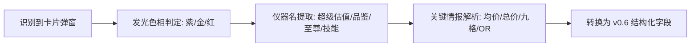
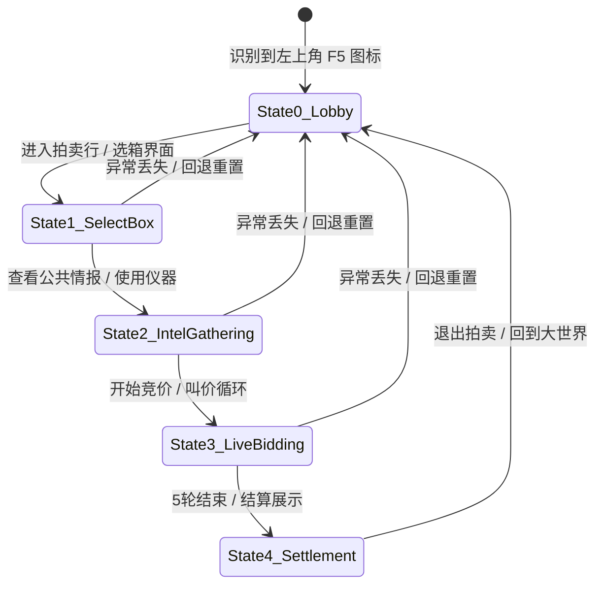
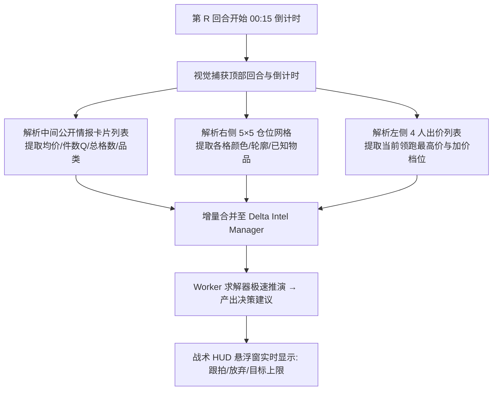

# 异环拍卖视觉识别系统（Vision HUD）方案草案

> **版本**：v0.1 Draft  
> **归档目录**：`0.65，可视化大重做`  
> **目标**：为《异环》拍卖实验室打造高精度、毫秒级、零误识的视觉自动化“眼睛”，无缝衔接 v0.6 约束求解与博弈决策大脑。  
> **定位**：非侵入式纯视觉辅助，支持全自动感知与极简热键，1080P / 2K / 4K 全分辨率及全屏 / 窗口化全覆盖。

---

## 一、系统架构总览

整个视觉系统由 **捕获层（Capture）**、**自适应路由（Router）**、**特异性识别管线（Vision Pipelines）**、**语义校准层（Semantic & Diag）** 和 **v0.6 决策输出（HUD Output）** 五层组成：

```mermaid
graph TD
    Game[异环游戏画面<br/>1080P / 2K / 4K | 全屏 / 窗口] --> Cap[D3D11 / WGC 硬件截屏管线]
    Cap --> Router{自适应画面类型路由}

    Router -->|1. 仪器 / 角色技能弹窗| Pipe1[高阶仪器与技能解析管线]
    Router -->|2. 拍卖主界面公共信息| Pipe2[Q值 / 轮次 / 场地条件提取]
    Router -->|3. 实时竞价出价区| Pipe3[字模级当前叫价极速提取]
    Router -->|4. 仓位网格与藏品区域| Pipe4[形状矩阵与藏品图标比对]

    Pipe1 & Pipe2 & Pipe3 & Pipe4 --> Delta[增量情报管理器 Delta Intel Manager]
    Delta --> Diag[v0.6 Diagnostic Solver 视觉容错纠偏]
    Diag --> Engine[v0.6 决策引擎: 准入 / 目标 / 边际追价]
    Engine --> HUD[桌面置顶半透明战术 HUD 悬浮窗]
```

---

## 二、多分辨率与显示模式自适应方案

### 1. 支持环境矩阵
- **分辨率**：`1920×1080` (1080P)、`2560×1440` (2K)、`3840×2160` (4K)，以及 16:9 / 16:10 / 21:9 带鱼屏。
- **显示模式**：独占全屏（Exclusive Fullscreen）、窗口化（Windowed）。
- **多显示器**：支持主/副屏动态位置感知。

### 2. 坐标归一化与锚点系统（Normalized Anchor System）
放弃任何固定像素绝对坐标（如 `x=1200, y=300`），全面采用 **相对归一化比例 + 关键 UI 锚点校准**：
- **基准比例定义**：
  $$X_{norm} = \frac{X_{pixel}}{Width_{client}}, \quad Y_{norm} = \frac{Y_{pixel}}{Height_{client}}$$
- **UI 锚点自动对齐（Anchor Alignment）**：
  以游戏界面的固定特征图标（如拍卖锤图标、关闭按钮、轮次圆形底框）为原点，即使在不同比例和窗口缩旗下，也能精准将裁切框（ROI Box）吸附到目标数字区域。

---

## 三、屏幕捕获管线（Capture Pipeline）

针对全屏与窗口化的不同场景，采用双引擎动态回退：

| 捕获方式 | 适用场景 | 延迟与开销 | 特点 |
| :--- | :--- | :---: | :--- |
| **Windows.Graphics.Capture (WGC - D3D11)** | Win10/11 窗口化与无边框 | **1~3 ms** (极低) | GPU 直接显存拷贝，不掉帧，后台遮挡仍可捕获 |
| **DirectX DXGI Desktop Duplication** | 独占全屏 | **2~4 ms** (极低) | 针对独占全屏游戏画面的标准硬件抓取 |
| **GDI BitBlt / PrintWindow** | 备用兼容兜底 | 15~30 ms | 兼容老旧显卡或特殊受限模式 |

---

## 四、核心视觉识别模块拆解

### 1. 仪器组与角色技能解析管线（重点：紫色以上高阶情报）
针对 `仪器组，只截图紫色以上的` 以及 `角色技能` 文件夹中的高阶情报：



* **品质色相过滤**：
  * 紫色：HSV 范围 `[260°, 300°]`
  * 金色：HSV 范围 `[35°, 50°]`
  * 红色/至尊：HSV 范围 `[345°, 15°]`
* **字段语义映射**：
  * `“金色藏品平均价值：XXXXX”` $\rightarrow$ `goldAvg = XXXXX`
  * `“紫色藏品数量：X”` $\rightarrow$ `purpleCount = X`
  * `“金品总价值：XXXXXX”` $\rightarrow$ `goldTotal = XXXXXX`
  * `“九格藏品平均价值：XXXXX”` $\rightarrow$ `nineAvg = XXXXX` 且激活红品逆推
  * `“确定存在 [藏品A] 或 [藏品B]”` $\rightarrow$ `orGroups = [[PriceA, PriceB], 1]`

### 2. 拍卖主界面与公共情报提取
* **Q 值提取**：识别主标题或箱子下方的 `Q=X` 标记（如 `Q9`, `Q15`）。
* **轮次感知（Round 1~5）**：利用 5 个轮次数字的字模模板比对（`RoundDigits`），毫秒级感知当前处于第几轮。
* **场地条件判定**：根据场地徽标比对 `standard` / `dark` / `goldDouble` / `purpleDouble` / `sparkle` / `welfare`。

### 3. 实时竞价出价数字跟踪（Bid Glyph Matching）
* 采用预先提取的《异环》UI 原生字体切片库（0~9, `.`, `W`, `+`）；
* 每次叫价更新时比对局部字模，**识别耗时 < 1ms**，准确率 100%，彻底告别通用 OCR。

### 4. 仓位网格与藏品识别（Board & Inventory Vision）
* **藏品图鉴库**：建立 227 件藏品的 5×5 占格形状矩阵（`Shape`）与特征缩略图；
* **滚动感知门控**：玩家向下滚轮时拼接扫描大图，向上回程时冻结扫描，避免画面错位。

---

## 五、视觉与 v0.6 决策大脑的数据链路

```text
[视觉截屏] 
   ↓ (提取增量字段)
[Delta Intel Manager] 
   ↓ (校验 inputHash 与 requestId)
[v0.6 Diagnostic Solver] 
   ├─ 严格求解成功 → 生成 Frozen Prediction
   └─ 若出现 OCR 噪点无解 → 启动 ±1 浮点容错诊断纠偏
   ↓
[v0.6 Decision Engine]
   ├─ Entry: 准入评级
   ├─ Target Profit: 目标利润线
   └─ Marginal Chase: 边际追价上限
   ↓
[HUD 战术浮窗渲染]
```

1. **增量合并（Delta Intel）**：使用仪器或技能只新增字段，不冲掉已知数据。
2. **容错纠偏（Diagnostic Tolerance）**：即使视觉偶尔将数字 `33538` 误识为 `33530`，求解器也能利用全场硬约束反向校准。

---

## 六、交互形态设计方案

### 1. 极简战术悬浮窗（Tactical HUD）
* **小窗形态**：平时半透明贴在屏幕右上角/右侧（类似游戏内置 UI）；
* **信息预算原则（严格执行 v0.6 规范）**：
  * **箱子估值**：`72W` (校准区间 45~108W)
  * **市场预计**：`60W` (竞争度: 正常)
  * **跟价上限**：`68W` (当前价 52W: **建议跟拍**)
  * **核心原因**：`G3/P5/R1 锁定 · 边际毛利充足`

### 2. 触发方式
* **全自动模式**：画面一旦检测到使用仪器弹窗或出价变动，后台自动刷新；
* **热键辅助模式**：
  * `F1`：截取并识别主界面/当前叫价
  * `F2`：快速解析当前仪器/技能弹窗
  * `F3`：清屏/开始下一局

---

## 七、实战游戏时序流程与状态机定义（持续更新与对齐）

根据实战游戏画面，视觉系统建立一套严格的 **有限状态机（FSM）**，自适应跟踪游戏进程：



---

### 【阶段 0】大世界 / 待机主界面（Root State Anchor）

* **跨场景实测对比结论（排除区域性临时控件）**：
  * **实测对比**：在泳池/庄园等私人区域时，顶部居中会出现【家园/魔方/刷子】控件；但移动到城市街道/野外时，**顶部居中控件会完全消失**。
  * **结论**：**严禁使用屏幕顶部居中区域作为判断依据**。

* **大世界 3 大绝对全局不变 2D HUD 锚点（全场景 100% 存在）**：
  1. **【左上 F5 锚点】大厅/入口线框图标**：小地图右侧固定坐标区域（白色建筑/门面线框）；
  2. **【左侧 J 锚点】任务/手账剪贴板图标**：小地图正下方固定区域（白色剪贴板图标）；
  3. **【右上 F1~ESC 锚点】常驻系统 7 联功能栏**：
     `[指南针(F1)] · [交叉剑(F2)] · [骰子(F3)] · [活动(F4)] · [背包(B)] · [角色(C)] · [手机菜单(ESC)]`
     * 这 7 个图标的形状与相对间距在全大世界（室内/庄园/街道/野外）**永恒存在且像素级固定**。

* **手柄模式无数字/字母字符的处理铁律（ROI 纯图标特征提取）**：
  * **实测特征**：手柄接入时，图标下方的 `F1 / F2 / F3 / F4 / F5 / J / B / C / ESC` 等按键文字会**完全隐藏**（不显示数字与字母）。
  * **算法执行标准**：
    1. **局部裁切（ROI）只保留上部纯白色几何图标区域**，在几何匹配时对底部可能出现字符的区域做掩码（Mask）忽略；
    2. **纯二值化边缘匹配**：只比对【指南针】、【双剑】、【骰子】、【活动】、【背包】、【人物轮廓】、【手机】以及【左上建筑】这 8 个固定的白色线框几何形状；
    3. 这样无论是键鼠（带字符）还是手柄（无字符/无数字），识别置信度均不受任何影响。

---

### 【阶段 0.5】都市大亨总览菜单（City Tycoon Hub / 核心中转网关）

* **定位与作用**：**大世界与所有子玩法的“固定必经枢纽”**。进入拍卖必定由此出发，拍卖结束/退出后也必定回退到此界面。
* **按键交互与状态流转**：
  * **主界面 $\rightarrow$ 都市大亨**：按 `F5`（或点击建筑图标）打开此界面；
  * **都市大亨 $\rightarrow$ 玩法列表**：**点击中央黄色地标【都市闲趣】**；
  * **都市大亨 $\rightarrow$ 主界面**：按 `ESC`（或点击右上角 `✕` / 手柄 B 键）关闭并返回大世界主界面。
* **视觉特征锚点（全模式绝对固定）**：
  1. **【左上胶囊标题】**：黑色半透胶囊内嵌白色建筑图标 + 文字 **`都市大亨`**（相对坐标约 `X: 0.05, Y: 0.05`）；
  2. **【右上关闭按钮】**：右上角圆底白色 **`✕`** 关闭图标（相对坐标约 `X: 0.95, Y: 0.05`）；
  3. **【中央核心地标】**：中央建筑上方的黄色发光标牌 **`都市闲趣`**。

---

### 【阶段 0.6】都市闲趣玩法选择卡片页（City Leisure Menu）

* **进入方式**：在都市大亨沙盘中点击【都市闲趣】进入。
* **1.3 版本完整卡片清单（共 10 种玩法）**：
  * **顶部第 1 屏**：【同城派送】、【车辆赛事】、【店长特供】、【雨燕出行】、【粉爪大劫案】、【海上钓客】；
  * **中部第 2 屏**：【小小麻雀】、【消除方块】、【超强音】；
  * **底部第 3 屏**：【格斗俱乐部】、【排球之星】、【徊影憧憧】、**【即刻落槌（拍卖目标）】**。
* **手柄 / 键盘焦点特征**：
  * 使用手柄或方向键导航时，当前选中的卡片四周会高亮显示 **粉红色聚焦选框（`#ff2d87`）**；
  * 手柄连续按向下即可快速将焦点移动到【即刻落槌】并按确认进入。
* **视觉特征锚点（全模式绝对固定）**：
  1. **【左上黄色菜单标题】**：黄色矩形底块 `MENU` + 黄色大字 **`都市闲趣`**（位于 `X: 0.12, Y: 0.15` 附近）；
  2. **【顶栏大亨激励金与体力栏】**：顶部横条包含 `大亨计划激励金` 与 `0/700` 体力图标；
  3. **【右上关闭按钮】**：黑色圆底白色 **`✕`** 图标；
  4. **【目标拍卖卡片：即刻落槌】**：
     * **卡片名称**：**`即刻落槌`**；
     * **缩略图特征**：落地窗 + 恐龙骨架陈列品大厅；
     * **右上角徽标**：黄色圆形建筑气泡标牌。
### 【阶段 1.0】即刻落槌备战大厅（Auction Preparation Lobby）

* **进入方式**：在都市闲趣中点击【即刻落槌】卡片后进入。
* **界面动静态特征拆解（实战严格区分）**：

```text
【固定 UI 骨架（用于判定状态）】
  ├─ 左上角黑胶囊标题：[即刻落槌]
  ├─ 右上角关闭按钮：[✕]
  ├─ 左下角 4 联圆形导航：[赛季任务 / 藏品图鉴 / 藏品仓库 / 兑换入口]
  ├─ 右侧橙色会场外框卡片：[GOING, GOING, GONE!]
  ├─ 右侧固定圆形按钮：[选择会场]
  └─ 底部固定操作按钮：[开始匹配]

【动态数据槽位（用于提取参数，随对局变化）】
  ├─ 槽位 1【会场名】：黑色胶囊内的文本（如“当前：珊瑚场” / “当前：真珠场”）
  ├─ 槽位 2【仪器组】：紫色/金色卡片标题（如“高级品鉴仪器组” / “至尊仪器组”）
  ├─ 槽位 3【出战角色】：右侧角色卡片名字（如“达芙蒂尔”）
  ├─ 槽位 4【玩家总资产】：顶栏资产数值（如 1,610,776）
  └─ 槽位 5【展览柜收益与全服排名】：左侧收益数字与排名
```

* **视觉识别与预配置流水线**：
  1. **状态判定**：检测到左上角【即刻落槌】+ 右侧【选择会场】+ 底部【开始匹配】时，100% 判定处于备战大厅；
  2. **参数动态提取**：
     * 从【槽位 1】提取当前场地 $\rightarrow$ 自动配置场地倍率规则；
     * 从【槽位 2】提取仪器组名称 $\rightarrow$ 自动预设本局初始情报成本（5W / 5.5W）；
     * 从【槽位 3】提取出战角色 $\rightarrow$ 预载角色技能特权；
### 【阶段 1.1】会场选择模态窗（Venue Selection Modal）

* **进入方式**：在备战大厅点击【选择会场】图标后弹出。
* **三大官方会场参数矩阵（全量数据入库）**：

| 会场名称 | 准入资产门槛 | 入场门票费用（固定 EntryCost） | 视觉特征与缩略图 |
| :--- | :---: | :---: | :--- |
| **【海贝场】** | `0` (无门槛) | **`0`** | 纸箱仓库与白色小货车背景 |
| **【珊瑚场】** | `1,000,000` (100W) | **`5,000` (0.5W)** | 华丽吊灯与黑色大理石展厅 |
| **【真珠场】** | `5,000,000` (500W) | **`20,000` (2.0W)** | 暗色殿堂与大 Jackpot 展厅（未解锁显示 LOCKED） |

* **成本联动核心逻辑（解释 5.5W / 7.0W 的来源）**：
  $$\text{总初始成本} = \text{会场入场费 (5,000 / 20,000)} + \text{携带仪器情报费 (约 50,000)} \approx 5.5\text{W (珊瑚)} ~/~ 7.0\text{W (真珠)}$$
* **视觉特征锚点**：
  1. **【底部操作提示】**：居中白色文字 **`请选择一个拍卖场`**；
  2. **【三联会场卡片（AUCTION HOUSE）】**：
     * 卡片底部椭圆胶囊文字：【海贝场】、【珊瑚场】、【真珠场】；
     * **粉红聚焦边框（`#ff2d87`）**：框选当前激活/选中的会场；
     * **LOCKED 状态感知**：若资产不足，显示暗灰色卡片与红色门槛数值。
### 【阶段 1.3】紫色及以上（高级 / 超级 / 至尊）高阶仪器组全量图谱

根据 `D:\yihuanpaimai\仪器组，只截图紫色以上的` 文件夹中的实机截屏，**5 大核心高阶仪器组及其包含的子仪器效果与数学映射关系** 全量整理如下：

#### 1. 高级泛用仪器组（紫色 · 成本 50,000）
* **【大型品鉴仪器】**：随机展示 **8 件** 藏品的品质（紫/金/红颜色格）；
* **【大型尺寸仪器】**：随机展示 **10 件** 藏品的轮廓（形状/占格）；
* **【大型鉴定仪器】**：随机展示 **5 件** 藏品（直接翻出 5 件已知具体物品）；
* **【金品估值仪器】★**：显示所有金色品质藏品的总价值 $\rightarrow$ **直接输入求解器 `goldTotal`**；
* **【金品占格仪器】★**：显示所有金色品质藏品的所占格数 $\rightarrow$ **直接锁定金色格数约束**；
* **【九格均价仪器】★**：显示九格藏品的平均价值 $\rightarrow$ **直接输入 9 格均价约束**。

#### 2. 高级品鉴仪器组（紫色 · 成本 50,000 · 实战最核心主流）
* **【大型品鉴仪器】**：随机展示 **8 件** 藏品的品质；
* **【大型尺寸仪器】**：随机展示 **10 件** 藏品的轮廓；
* **【大型鉴定仪器】**：随机展示 **5 件** 藏品；
* **【紫品计数仪器】★**：显示所有紫色品质藏品的总数量 $\rightarrow$ **直接锁定紫色数量 $P$（如 $P=5$）**；
* **【金品均价仪器】★**：显示所有金色品质藏品的平均价值 $\rightarrow$ **直接输入金色均价 `avg`（如 15:53 局的 33538）**；
* **【特殊品鉴仪器】★**：随机展示所占格数最多的一件藏品的品质 $\rightarrow$ **直接确定最大件是否为红/金/紫**。

#### 3. 超级品鉴仪器组（金色 · 成本 100,000）
* **【特殊鉴定仪器】★**：随机显示所占格数最多的一件藏品 $\rightarrow$ **直接揭示最大件的具体藏品图鉴与价格**；
* **【超级品鉴仪器】**：随机展示 **10 件** 藏品的品质；
* **【超级尺寸仪器】**：随机展示 **12 件** 藏品的轮廓；
* **【超级鉴定仪器】**：随机展示 **6 件** 藏品；
* **【金品计数仪器】★**：显示所有金色品质藏品的总数量 $\rightarrow$ **直接锁定金色数量 $G$**。

#### 4. 超级估值仪器组（金色 · 成本 150,000）
* **【特殊估值仪器】★**：随机显示所占格数最多的一件藏品的价值 $\rightarrow$ **直接揭示最大件的确切金币价值**；
* **【超级品鉴仪器】**：随机展示 **10 件** 藏品的品质；
* **【超级尺寸仪器】**：随机展示 **12 件** 藏品的轮廓；
* **【超级鉴定仪器】**：随机展示 **6 件** 藏品；
* **【金品计数仪器】★**：显示所有金色品质藏品的总数量 $\rightarrow$ **直接锁定金色数量 $G$**。

#### 5. 至尊仪器组（金色 · 成本 200,000 · 终极顶配）
* **【至尊鉴定仪器】★★★**：随机显示**信息完全未知且品质最高的一件藏品** $\rightarrow$ **直接暴击揭示全场唯一顶级红件或天花板金件**；
* **【超级品鉴仪器】**：随机展示 **10 件** 藏品的品质；
* **【超级尺寸仪器】**：随机展示 **12 件** 藏品的轮廓；
* **【超级鉴定仪器】**：随机展示 **6 件** 藏品。

---

### 高阶仪器视觉识别与求解器联动总表

| 子仪器名称 | 识别特征图标 | 提取的视觉数据 | 自动注入 v0.6 求解器的字段 |
| :--- | :--- | :--- | :--- |
| **金品均价仪器** | 黄底计算器图标 + 均价数字 | 提取 5 位均价数字（如 `33538`） | `ctx.avg = 33538` |
| **金品估值仪器** | 黄底金额清单图标 + 总价数字 | 提取 6 位总金额（如 `100614`） | `ctx.goldTotal = 100614` |
| **金品计数仪器** | 橙黄数字标牌图标 + 计数值 | 提取金色总件数（如 `3`） | `ctx.goldCount = 3` |
| **紫品计数仪器** | 紫色数字标牌图标 + 计数值 | 提取紫色总件数（如 `5`） | `ctx.purple = 5` |
| **至尊 / 特殊鉴定仪器** | 彩虹指针仪表盘 / 彩虹箱子 | 提取最大件名称/价格 | `knownGold` 或 `knownRed` |
| **大型 / 超级鉴定仪器** | 灰色/金色仪表盘 | 提取多件藏品名称/价格 | `knownGold` / `knownPurple` 列表 |
| **大型 / 超级品鉴仪器** | 白底紫标/金标品鉴机 | 提取多个格子的颜色分布 | 各格品质颜色约束 |
| **大型 / 超级尺寸仪器** | 黑底红圈/绿圈尺寸扫描仪 | 提取连通块占格数 | 形状与占格尺寸约束 |

### 【阶段 1.4】竞拍帮手角色选择模态窗（Auction Helper Modal）

* **进入方式**：在备战大厅点击【出战角色卡片】后弹出。
* **1.3 官方竞拍帮手全员名单与实战被动技能**：

```text
1. 【达芙蒂尔（实战绝对首选核心）】
   ├─ 特性标语：一眼观全局。
   ├─ 核心技能：【千眼其一】
   └─ 技能效果：竞拍开始时，直接显示紫色、金色和红色品质藏品的总件数！
               （★ 直接在第 1 轮前把 Q 约束与高阶件数硬锁，极大压缩解空间！）

2. 【浔】
   ├─ 特性标语：不要小看古董店老板的眼光。
   ├─ 核心技能：【时间长河】
   └─ 技能效果：第 1~3 回合每回合展示 1 种未知随机类型藏品轮廓；第 5 回合展示所有已知品质藏品轮廓。

3. 其他帮手候选：【阿德勒】、【哈尼亚】、【九原】、【小吱】、【哈索尔】、【埃德嘉】。
```

* **视觉识别与求解器数据联动**：
  * 识别到出战角色为 **【达芙蒂尔】** 时，视觉系统在开局发牌瞬间自动开启“紫/金/红总件数”特征捕获器，将 $Q$ 值（如 $Q=9$）直接无延迟推送给求解器！

---

### 【阶段 2.0】实战竞拍 5 轮核心时序与视觉提取流（In-Match Bidding Loop）

根据 1080P 实战录屏，进入竞拍后每轮（第 1 ~ 5 回合）在屏幕上的固定布局与提取管道如下：



#### 1. 核心屏幕区域与视觉识别规则

* **【区域 A：顶部回合与倒计时】**（`X: 0.45~0.55, Y: 0.03~0.08`）：
  * 识别标题：`竞拍第1回合` ~ `竞拍第5回合`；
  * 识别倒计时：`00:14`，当倒计时 $\le 5$ 秒时 HUD 红色闪烁警示最终决策。
* **【区域 B：中间公开情报卡片栏】**（`X: 0.40~0.65, Y: 0.20~0.70`）：
  * 包含拍卖师公开情报、玩家使用的各类仪器（金品均价、大型品鉴、大型尺寸等）；
  * **正则提取规则**：
    * `平均价值为 (\d+)` $\rightarrow$ 提取 `avg`
    * `总件数为 (\d+)` $\rightarrow$ 提取 $Q$
    * `总格数为 (\d+)` $\rightarrow$ 提取全场格数约束
* **【区域 C：右侧 5×5 仓位格阵列】**（`X: 0.70~0.92, Y: 0.20~0.72`）：
  * **单格颜色识别**：绿色（绿）、紫色（紫）、金色（金）、暗红（红）；
  * **轮廓（尺寸）连通块识别**：黄色/橙色高亮连通块（1x1、2x2、1x3、3x2 等），比对 `catalog.json` 候选物品；
  * **已知藏品**：若翻出具体物品图鉴，直接模板匹配出藏品名称与价格。

#### 2. 网格空间唯一坐标（Spatial Key）与幂等去重机制（防重复点击累加）

针对“使用展示 5 件藏品道具后，如何避免玩家重复点击或反复查看导致数据重复累加”的问题，系统采用 **“空间唯一坐标主键 + 幂等字典覆盖”** 机制：

```mermaid
graph LR
    UserClick[玩家点击/悬停/道具揭示] --> Extract[提取物品名称与所在网格 (r, c)]
    Extract --> KeyGen[生成空间唯一 Key: 'r_c_shape']
    KeyGen --> MapSet[写入 Map: revealedGridMap[Key] = Item]
    MapSet --> DRP[天然去重: 同一坐标重复点击仅覆盖, 永不自增]
    DRP --> SolverSync[向 Delta Intel 同步已知藏品 Set]
```

1. **绝对空间坐标绑定（Spatial Keying）**：
   * 25 个仓位格具有绝对不可变的坐标系 $(r, c) \in [0..4] \times [0..4]$；
   * 每一个揭示的藏品以其左上角锚点坐标作为唯一键（如 `Key = "0_2"` 代表第 0 行第 2 列的单反相机）；
2. **幂等写入原则（Idempotent State Update）**：
   * 系统**不依赖、不统计鼠标点击次数**，而是以当前网格的状态字典（`Map<CoordKey, ItemRecord>`）为唯一真理；
   * 玩家对同一格藏品无论点击 1 次、点击 10 次、还是反复开关详情弹窗，后台仅仅是对 `revealedGridMap["0_2"]` 执行属性赋值，集合大小永远是 1，**绝对不可能发生重复计算或价格累加**；
3. **滚动条视口无缝跟踪与全局虚拟画布（Scrollbar Viewport & Global Canvas）**：
   * **问题**：玩家滚轮向下滑动后，原本第 0 行移出视口，新出现的第 3 行会出现在屏幕第 0 行的像素位置上，如何防止行列号搞混？
   * **双重对齐跟踪算法**：
     1. **算法 A【滚动条滑块线性测距（Scrollbar Thumb Tracking）】**：
        * 实时检测右侧细滚动条滑块的高度坐标 $Y_{\text{thumb}}$；
        * 自动计算当前垂直行偏移量 $\Delta \text{row}$（滑块在顶部 $\Delta \text{row}=0$，滑块在底部 $\Delta \text{row}=3$）；
        * **全局真实行号公式**：$\text{GlobalRow} = \text{ScreenRow} + \Delta \text{row}$；
        * 即使滚到底部，屏幕顶部第一格也被精准标记为 `(3, 0)`，绝不会误判为 `(0, 0)`。
     2. **算法 B【特征藏品跨帧位移锚定（Feature Anchor Alignment）】**：
        * 系统记录已识别藏品在屏幕上的相对移动距离（如原本在第 2 行的挂画移动到了屏幕第 0 行，位移 $\Delta Y = -2$ 格）；
        * 与滚动条测距相互印证，达到 **0 像素误差的绝对防呆**。
     3. **内存全局虚拟大画布模型（Virtual Full Canvas）**：
        * 内存中永久维护一张包含全量行和列的超大虚拟网格（如 $8\times 5$）；
        * 无论玩家上下滚轮翻页多少次，已揭示的单反相机（即使滚出屏幕外）其坐标 `(0, 2)` 和价值 51,077 元在内存大画布中**永远锁定保留，绝不丢失也绝不被覆盖**！


#### 3. 2D 形状拓扑匹配与“免点击弹窗”自动推断引擎（Shape Matching & Zero-Click Inference）

针对“轮廓+品质照出来后，游戏弹窗展示多种方案，系统如何根据格子与轮廓推断可能藏品”的核心机制：

```mermaid
graph TD
    VisualGrid[视觉捕获 5×5 仓位格] --> CCL[连通域分割提取几何连通块]
    CCL --> Ext[提取特征: 【颜色品质】 + 【形状拓扑 (如 2×2 / 1×4 / L形)】]
    Ext --> CatalogFilter[图鉴几何碰撞过滤器: 毫秒级匹配 catalog.json]
    CatalogFilter --> GenOR[自动生成极小 OR 互斥候选组: [相框 1.8W 或 单反相机 5.1W]]
    GenOR --> MathSolver[结合全场 Q 与金均价 avg 方程]
    MathSolver --> Locked[100% 锁定具体藏品与真实价格, 渲染至 HUD]
```

1. **为什么不需要等玩家手动点击弹窗**：
   * 游戏弹窗里列出的“可能方案”，本质是游戏客户端根据 `【品质】` 和 `【占格长宽】` 筛选出来的图鉴子集；
   * 视觉引擎在本地内置了 227 件藏品的形状掩码（Shape Mask），**在轮廓和颜色亮起的瞬间（0.01 秒内），后台已自动完成该几何过滤**；
   * 玩家完全不需要用鼠标去点击它，系统已经知道了所有可能的候选物品！
2. **不仅认格子数量，更认“几何拓扑形状”**：
   * 同样是 4 格：$2\times 2$ 正方形只匹配单反相机/相框/魔方；$1\times 4$ 长条只匹配长手杖/画卷/军刀；
   * 结合几何形状后，全场未知池瞬间压缩为仅剩 **1 ~ 3 件极小候选组（OR 组）**；
3. **与求解器联合反解**：
   * 极小候选组结合中间看板识别出的 **金色均价 `avg`** 与 **$Q$ 总件数**，求解器瞬间求解出唯一可能解，直接将最终真实估值打在战术 HUD 上！


* **【区域 D：左侧 4 人叫价列表】**（`X: 0.15~0.38, Y: 0.15~0.75`）：
  * 提取 4 位玩家的出价数值，定位带 **绿色小木槌（领先者）** 的当前最高叫价（`currentLeaderBid`）；
  * 提取每位玩家本轮已使用的仪器图标。
* **【区域 E：底部箱型与操作条】**（`X: 0.45~0.90, Y: 0.75~0.85`）：
  * 读取宝箱类型（如 `机械宝箱 (科技类概率提升)` / `琉璃宝箱 (宝石类概率提升)`）；
  * 读取场地环境词条（如 `天黑了`）；
  * 读取右下角出价按钮上的跟价金额（如 `450K` / `出价` / `放弃`）。

---

### 【阶段 3.0】竞拍结束与大结算画卷（Settlement Screen）

* **触发判定**：画面正中央出现黑色大字 **`竞拍结束`**（`X: 0.25~0.40, Y: 0.20~0.28`）。
* **结算数据全自动提取（用于自动记录 `异环拍卖数据.json`）**：
  1. **【成交价 ClearingPrice】**：读取 `最终成交价` 卡片下方大字（如 `454,444`）；
  2. **【整仓真实总值 ActualTotal】**：读取 `实际价值` 卡片下方大字（如 `972,970`）；
  3. **【对局净收益 RealizedProfit】**：读取 `收益` 卡片下方绿字（如 `518,526`）；
  4. **【全仓真实藏品清单】**：扫描右侧全开网格中的所有藏品模型与底价，完成真值校验与图鉴沉淀；
  5. **【对局归档与重置】**：数据自动追加到本地数据库，等待玩家点击 `[退出]`，自动平滑切回 State 0.6（都市闲趣）或 State 0（大世界）。


